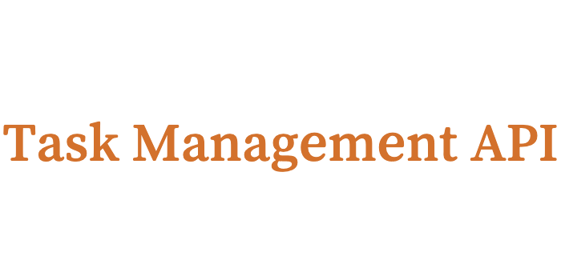
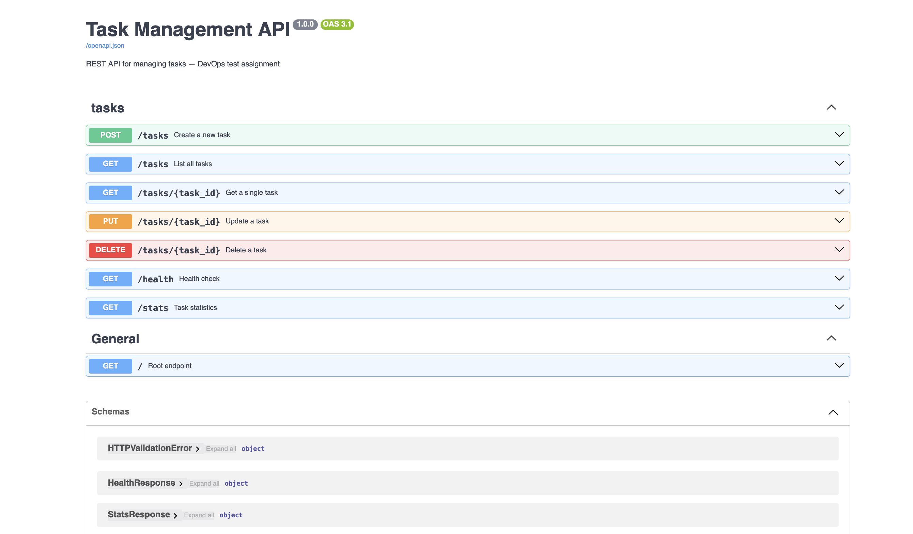
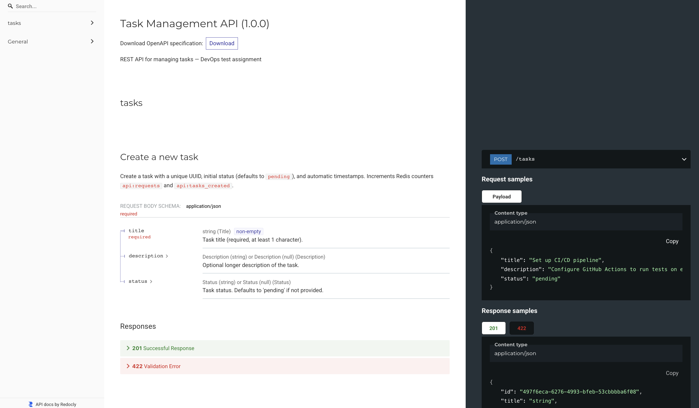

<p align="center">
  
</p>


[English](README.md) · **Русский**

# Task Management API

<p align="center">
  
  
</p>

## Структура проекта

1. [О проекте](#о-проекте)
2. [Использование](#использование)
3. [Установка и запуск](#установка-и-запуск)
4. [Конфигурация](#конфигурация)
5. [CI/CD переменные](#cicd-переменные)
6. [Как запушить](#как-запушить)

## О проекте

Task Management API, REST API для управления задачами.

Стек: Python, FastAPI, PostgreSQL, Redis.

Приложение состоит из исходного кода и файла зависимостей ( requirements.txt )

## Использование

API предоставляет следующие возможности:
- Создание, чтение, обновление и удаление задач (CRUD)
- Фильтрация задач по статусу
- Простая статистика
- Health endpoint для проверки работоспособности

После запуска все эндпоинты доступны в интерактивной документации Swagger:

http://localhost:8000/docs

Альтернативный вид документации (ReDoc):

http://localhost:8000/redoc

## Установка и запуск

1. Клонировать репозиторий:

```bash
git clone https://github.com/vladislav-devops/task-management.git
cd task_management
```

2. Скопировать пример переменных окружения:

```bash
cp .env.example .env
```

При необходимости поправить значения в `.env` (пароли, порты), см. секцию [Конфигурация](#конфигурация).

3. Запустить весь стек:

```bash
docker compose up -d --build
```

При первом запуске compose соберёт образ из `Dockerfile`.

4. Подождать примерно 30 секунд, пока сервисы поднимутся. Проверить статус, можно командой:

```bash
docker compose ps
```

Все контейнеры должны быть в состоянии `Up` или `Up (healthy)`.

5. Открыть в браузере:

- API: [http://localhost:8000/docs](http://localhost:8000/docs)
- Health: [http://localhost:8000/health](http://localhost:8000/health)
- Grafana (логи): [http://localhost:3000](http://localhost:3000)

6. Остановить:

```bash
docker compose down
```

Чтобы удалить и данные (БД, логи), используем флаг `-v`:

```bash
docker compose down -v
```

## Конфигурация


Все настройки задаются через переменные окружения в файле `.env`. В репозитории лежит шаблон `.env.example` со всеми доступными переменными и значениями по умолчанию.

Сам `.env` в git не коммитится (он добавлен в `.gitignore`), так как может содержать чувствительные данные. Перед запуском нужно создать его из шаблона:

```bash
cp .env.example .env
```

Основные переменные:

- `APP_PORT` - порт, на котором приложение слушает на хосте. По умолчанию 8000.
- `LOG_LEVEL` - уровень логирования (DEBUG, INFO, WARNING, ERROR). По умолчанию INFO.
- `POSTGRES_USER` - имя пользователя БД.
- `POSTGRES_PASSWORD` - пароль БД.
- `POSTGRES_DB` - имя базы данных.
- `POSTGRES_PORT` - порт PostgreSQL внутри сети compose. По умолчанию 5432.
- `REDIS_HOST` - хост Redis. Внутри docker compose это `redis`. Если запускаешь приложение без compose, поставь `localhost`.
- `REDIS_PORT` - порт Redis. По умолчанию 6379.
- `GRAFANA_ADMIN_PASSWORD` - пароль администратора Grafana. ДОЛЖЕН быть заменен (в .env.example `admin`).

После любых изменений в `.env` нужно перезапустить стек, чтобы переменные подхватились:

```bash
docker compose up -d --force-recreate
```

## CI/CD переменные

Для работы deploy стадии в pipeline нужны переменные в GitLab. Зайди в **Settings -> CI/CD -> Variables** проекта и добавь:

- `DEPLOY_SSH_KEY_B64` - приватный SSH ключ для подключения к серверу, закодированный в base64. Сгенерировать пару ключей и получить значение для переменной:

```bash
ssh-keygen -t ed25519 -f deploy_key -N ""
base64 -w 0 < deploy_key
```

Тип переменной: **Variable** (не File). Скопировать вывод base64 как значение.

- `DEPLOY HOST` - IP или hostname сервера, на который деплоим.
- `DEPLOY USER` - пользователь на сервере. Должен быть в группе `docker`.

Публичный ключ (`deploy key.pub`) нужно положить на сервер в `~/.ssh/authorized keys` пользователя `DEPLOY USER`:

```bash
cat deploy_key.pub
# скопировать вывод, на сервере выполнить:
mkdir -p ~/.ssh && chmod 700 ~/.ssh
echo "ssh-ed25519 AAAA..." >> ~/.ssh/authorized_keys
chmod 600 ~/.ssh/authorized_keys
```

**Настройка `APP_ENV_B64` в GitLab**

1. Убедись что у тебя локально есть реальный `.env` файл с настоящими значениями (пароли, порты и т.д.).
2. Закодируй в base64:
```bash
base64 -w 0 < .env
```
Скопируй весь вывод.
3. Открой GitLab в браузере.
4. В левом меню → **Settings** → **CI/CD**.
5. Раскрой секцию **Variables**.
6. Нажми **Add variable**.
7. Заполни:
   - **Key:** `APP_ENV_B64`
   - **Value:** вставь base64 из шага 2
   - **Type:** Variable
   - **Flags:** включи Protected, Expanded оставь как есть
   - **Environments:** All (по умолчанию)
8. Нажми **Add variable**.
9. Готово. Следующий запуск pipeline возьмёт это значение и запишет на сервере в `/opt/junior-task/.env`.

Чтобы обновить `.env` позже: перегенерируй `base64 -w 0 < .env`, отредактируй переменную в GitLab, перезапусти pipeline.

На сервере также должно быть:
- Установлены Docker и Docker Compose
- Пользователь из `DEPLOY_USER` в группе `docker`

P.S. 
На сервере добавь пользователя в группу `docker`:

```bash
sudo usermod -aG docker <твой пользователь>
```

После этого нужно переподключиться по SSH чтобы группа подхватилась. Проверить:

```bash
groups <твой пользователь>
```

В выводе должен быть `docker`.

## Как запушить


1. Внести изменения в код или конфигурацию.

2. Добавить изменённые файлы в коммит:

```bash
git add .
```

3. Закоммитить с понятным описанием:

```bash
git commit -m "что было сделано"
```

4. Запушить в репозиторий:

```bash
git push
```

После пуша в ветку `main` автоматически запускается CI/CD pipeline в GitLab:

1. Запускаются тесты (`pytest`).
2. Собирается docker образ через buildah.
3. Образ публикуется в container registry в gitLab.
4. Приложение деплоится на сервер: rsync конфигов, `docker compose pull` и `docker compose up -d`.

Статус пайплайна можно посмотреть в GitLab: CI/CD -> Pipelines.

P.S. если пушишь в любую другую ветку (не `main`), запустится только стадия тестов. Сборка и деплой триггерятся только из `main`.

---
© 2026 Made by Vladislav Levchenko. Licensed under the MIT License.
